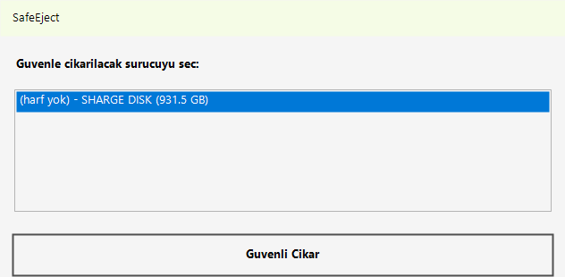
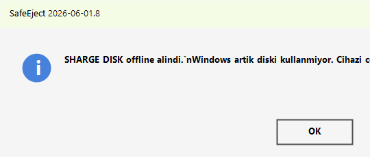

# SafeEject

**SafeEject** is a Windows utility for safely removing external SSDs and USB storage devices when Windows refuses to eject them. It is designed especially for fast USB-C / UASP SSD enclosures that can stay mounted, busy, or powered even after the drive letter disappears.

Developed by **Ihsan Burak** as a practical, safety-first tool for people who move large files, Steam libraries, backups, video projects, and portable workspaces on external SSDs.



## English

### Why SafeEject exists

Windows sometimes fails to eject an external SSD with a vague “device is in use” message. In real-world use, the blocker may be a file handle, a mounted volume node, a missing drive letter, or a disk that needs to be taken offline before the USB hardware can be removed.

SafeEject combines several Windows-safe removal steps into one small app:

- Detects USB attached disks with `Get-Disk`
- Lists one or more removable SSD / USB storage devices
- Attempts normal Windows PnP eject through `CM_Request_Device_Eject`
- Detects applications holding the drive through Restart Manager
- Dismounts drive letters and volume GUID paths
- Handles disks whose drive letter has already disappeared
- Falls back to taking the disk offline when Windows keeps the volume busy
- Tries to remove the underlying USB hardware after the disk is offline
- Can bring an offline disk back online and restore a missing drive letter



### Download

Use the Windows executable from the latest release/artifact:

- `SafeEject.exe` for normal users
- `SafeEject.ps1` for developers or manual PowerShell use

The executable requests administrator permission because Windows requires elevated rights for disk offline/online and hardware removal operations.

### Usage

1. Close file copy windows, Steam, backup tools, terminals, and Explorer windows using the external SSD.
2. Run `SafeEject.exe`.
3. Select the external SSD if more than one USB disk is connected.
4. Click **Guvenli Cikar**.
5. Wait for a success message:
   - safely ejected,
   - offline and safe to unplug,
   - or offline and hardware removed.

If the disk is later reconnected and Windows keeps it offline, run SafeEject again. It will offer to bring the disk online and restore the drive letter.

### Safety Notes

SafeEject does not format, erase, or modify files. The offline fallback is used only after normal eject attempts fail. Taking a disk offline is much safer than unplugging it while Windows still has the filesystem mounted, but you should still avoid running it during active writes, downloads, game updates, or backups.

### Technical Overview

SafeEject uses:

- PowerShell storage cmdlets: `Get-Disk`, `Get-Partition`, `Set-Disk`, `Add-PartitionAccessPath`
- Win32 volume control: `FSCTL_LOCK_VOLUME`, `FSCTL_DISMOUNT_VOLUME`
- Configuration Manager APIs: `CM_Request_Device_Eject`, `CM_Query_And_Remove_SubTree`
- Restart Manager APIs to detect processes using a drive
- `pnputil` as a final device-removal fallback

## Turkce

**SafeEject**, Windows’ta harici SSD veya USB diskleri guvenle cikarmak icin gelistirilmis pratik bir aracidir. Ozellikle USB-C / UASP kutulardaki SSD’lerde Windows bazen “cihaz kullanimda” diyerek diski birakmaz; bazen de surucu harfi kaybolur ama donanim hala calisir. SafeEject bu durumlari tek uygulama icinde toparlar.

### Ne yapar?

- Bagli USB diskleri listeler
- Normal Windows guvenli kaldirma API’sini dener
- Diski kullanan uygulamalari tespit etmeye calisir
- Surucu harfi ve volume GUID uzerinden dismount dener
- Harfi kaybolmus diskleri de isleyebilir
- Gerekirse diski offline alir
- Offline sonrasi USB donanimini kaldirmayi dener
- Tekrar takildiginda disk offline kalirsa online yapmayi teklif eder
- Surucu harfi yoksa tekrar harf atayabilir

### Nasil kullanilir?

1. Diski kullanan uygulamalari kapatin: Steam, Explorer, terminal, yedekleme/senkronizasyon araclari.
2. `SafeEject.exe` dosyasini calistirin.
3. UAC/yetki penceresi gelirse **Evet** deyin.
4. Birden fazla USB disk varsa cikarmak istediginiz diski secin.
5. **Guvenli Cikar** dugmesine basin.
6. Basari mesajindan sonra diski cekebilirsiniz.

### Guvenlik

SafeEject dosyalarinizi silmez, format atmaz ve bolum yapisini degistirmez. Offline alma islemi, Windows’un diski kullanmayi birakmasi icindir. Aktif dosya yazma, oyun guncellemesi, kopyalama veya yedekleme devam ederken hicbir diski cikarmayin.

## Build

```powershell
dotnet publish src/SafeEject.Launcher/SafeEject.Launcher.csproj `
  -c Release `
  -r win-x64 `
  --self-contained true `
  -p:PublishSingleFile=true `
  -p:EnableCompressionInSingleFile=true `
  -o dist
```

Output:

```text
dist/SafeEject.exe
```

## License

MIT
